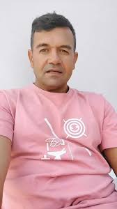

# My  Presentation

My name is Anxo Boquete Otero, I`m 20 years old and I live in Santiago de Compostela.

## A experience you really proud of
This year I was able to overcome one of my greatest fears: traveling by plane due to my fear of heights.

## My personal hero

[Oscar Garcia](https://www.tiktok.com/@oscargarcia_full/video/7379878354196892960)

My personal hero is Oscar García, a galician influencer who makes funny tiktoks in our language.

`se non queres vir desbrozar, non veñas desbrozar`

## The worst food of the world

The worst food of the world is the **broccoli**, I hate both the smell and the taste. I don´t understand why people eat it. 

## The three more useful/entertaining apps
1. ***Tiktok***: You can stay watching videos for hours if you want because there`re so interesting 
2. ***Netflix***: I am a very cinephile and I love watch movies or films at my hause, Netflix is ​​what I normally use to watch movies. 
3. ***Youtube***: In Youtube I can see relaxing videos about creating dioramas, videos about painting figures and about video games that I like

## The best gift you have ever received/given
The best gift I had was a PS4 for my birthday.
## A dream that you have to accomplish
Visit [japan](https://japonismo.com/blog/que-ver-y-hacer-en-japon?utm_content=cmp-true), since 2010 I wish visit Japan because I love that country.

## If you could time travel to any year in the past or future, which would you choose?
I would choose my trip to Andorra in 2022 with my classmates for skiing.
## Two hobbies
* play videogames like fortnite, overwatch, apex...
* watch movies or series 
## Your English level (have you got any certification?)
My english certification is a b1 in TOEF certification
## Your Computer Science background
I have knowledge of both programming and the use of the computer itself.